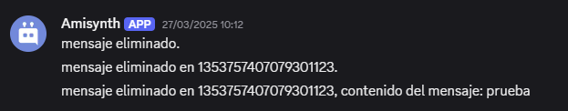

# $onMessageDelete  

`$onMessageDelete` se activa cuando un mensaje es eliminado en el servidor.  

```
$onMessageDelete
```

Es una llamada de retorno, lo que significa que se utiliza en el disparador del comando (no en el código). Se ejecuta automáticamente cuando un mensaje es eliminado en un canal.  

> 📌 Se puede tener varios `$onMessageDelete` por bot, pero no es recomendable.  

**Sintaxis**  

> No requiere sintaxis específica, pero para capturar detalles del mensaje eliminado, se pueden usar funciones como `$getMessageDelete[]`, `$channelID[]`, y `$authorID[]`.  

**Ejemplo**  

```python
bot = ...

bot.new_event("$onMessageDelete", 
               """
               Mensaje eliminado.
               Mensaje eliminado en: $channelID[]
               Mensaje eliminado en: $channelID[], contenido del mensaje: $getMessageDelete[]
               """)
bot.run(..)
```  

