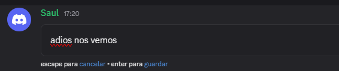
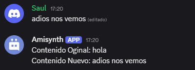

# $onMessageEdit  

`$onMessageEdit` se activa cuando un mensaje es editado en el servidor.  

```
$onMessageEdit
```

Es una llamada de retorno, lo que significa que se utiliza en el disparador del comando (no en el código). Se ejecuta automáticamente cuando un usuario edita un mensaje en un canal.  

> 📌 Se puede tener varios `$onMessageEdit` por bot, pero no es recomendable.  

**Sintaxis**  

> No requiere sintaxis específica, pero para capturar detalles del mensaje editado, se pueden usar funciones como `$editMessageAfter[]`, `$editMessageBefore[]`, `$channelID[]` y `$authorID[]`.  

**Ejemplo**  

```python
bot = ...

bot.new_event(name="$onMessageEdit", 
              code="""
                Contenido Original: $editMessageAfter[] 
                Contenido Nuevo: $editMessageBefore[].
                """)

bot.run(..)
```  





