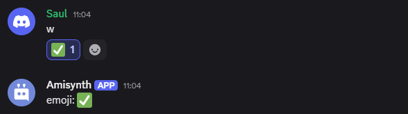

# $onReactionAdd  

`$onReactionAdd` es un evento que se activa cuando un usuario añade una reacción a un mensaje en el servidor.  

### **Sintaxis**  
```
$onReactionAdd
```

> 📌 **Nota:** Este evento se usa como un disparador, no dentro del código del comando.  


### **Ejemplo**  

```python
bot = ..

bot.new_event("$onReactionAdd", "Emoji: $reactionEvent[]")

bot.run(..)
```
🔹 Si un usuario llamado "Saul" reacciona con "✅" en el canal `#general`, el bot enviará:  


