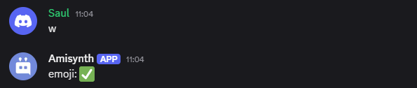

# $onReactionRemove  

`$onReactionRemove` se activa cuando un usuario elimina una reacción de un mensaje en el servidor.  

```
$onReactionRemove
```

Es una llamada de retorno que se ejecuta automáticamente cuando un usuario quita una reacción de un mensaje.  

> 📌 Se puede tener varios `$onReactionRemove` por bot, pero no es recomendable.  

**Sintaxis**  

> No requiere sintaxis específica, pero para capturar detalles de la reacción eliminada se pueden usar funciones como `$reactionEvent[]`, `$channelID[]`, `$messageID[]`.  

**Ejemplo**  

```python
bot = ...

bot.new_event("$onReactionRemove", "Emoji: $reactionEvent[]")

bot.run(..)
```  

