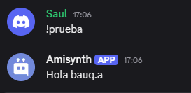
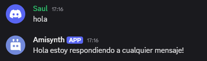
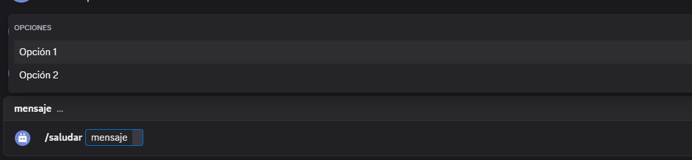

# Tipos de usos

En la libreria se pueden hacer varios usos, como el hecho que he puesto a disposicion crear comandos, crear eventos, creas comando con barra digonal.

## Crear un comando de discord

```python
# importa LA libreria y luego el cliente

from Amisynth.client import AmiClient

# Has la instancia

bot = AmiClient("!")


# Crea el comando :D

bot.new_command(name)="prueba",
                type="text",
                code="Hola $username[]!")

bot.run("TOKEN DE TU BOT")
```




## Crea un evento de discord


```python
from Amisynth.client import AmiClient

# Has la instancia

bot = AmiClient("!")


# Crea el evento :D
bot.new_event(name="$onMessage", 
              code="Hola estoy respondiendo a cualquier mensaje!")

bot.run("TOKEN DE TU BOT")
```



> Puedes en ver los eventos disponibles en [Eventos](../Eventos/)


## Crea un comando slash de discord


```python
from Amisynth.client import AmiClient

# Has la instancia

bot = AmiClient("!")


bot.new_slash(
    name="despedir",
    description="Saluda a un usuario con un mensaje personalizado",
    code="""
     $addSlashOption[usuario;..;Usuario;True;False]
    Adios!""")

# Slash Con Choices 


bot.new_slash(
    name="saludar",
    description="Saluda a un usuario con un mensaje personalizado",
    code="""
    $addSlashOption[mensaje;..;Texto;True;False]
    $addSlashChoiceOption[mensaje;Opcion 1;op1]
    $addSlashChoiceOption[mensaje;Opcion 2;op2]
    Hola!""")


bot.run("TOKEN DE TU BOT")
```

