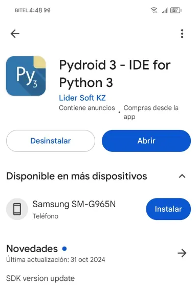
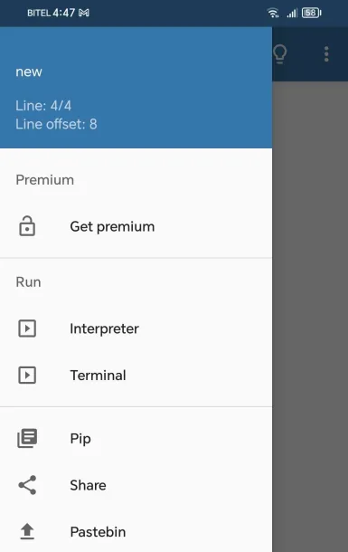
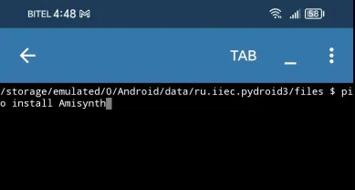

# 📌 Comenzando

Para usar nuestra libreria debes tener lenguaje de programacion llamado Python para usar nuestra libreria.

## Instalar Python en Windows

Si aún no tienes Python instalado, descárgalo desde la página oficial:

- [Python Downland](https://www.python.org/downloads/)

> Si eres nuevo puedes seguir un video tutorial de como instalar python rrapidamente en tu Sistema Windows: [Link](https://www.youtube.com/watch?v=xd_0RN2SyfI)

Ahora necesitaras un editor de codigo!

> Si eres nuevo te seguiero ver un video de como usar el editor de codigo mas famoso de todos aqui el video: [Visual Estudio Code](https://www.youtube.com/watch?v=6pD7_rcFrj8):

- Link de aplicacion de escritorio: [Visual Estudio Code Downland](https://code.visualstudio.com/download)

## Instalar Python en Android

### [PyDroid](https://play.google.com/store/search?q=pydroid+3&c=apps)

   Puedes usar un app famosa para instalar nuestra libreria, esta aplicacion ya viene por default con python instalado.

 - Instala la APP en la Play Store o en App Store

    

- Ve al seccion de terminal de la app para instalar la libreria:

    

 - En el terminal escribe

   `pip install --upgrade Amisynth`

    

Listo ya puedes usar nuestra Libreria!

  > Esta aplicacion esta comprobada que no se puede usar en segundo plano

