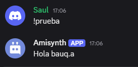

# Tipos de usos

En la libreria se pueden hacer varios usos, como el hecho que he puesto a disposicion crear comandos, crear eventos, creas comando con barra digonal.

## Crear un comando de discord

```python
# importa LA libreria y luego el cliente

from Amisynth import AmiClient

# Has la instancia

bot = AmiClient("!")


# Crea el comando :D

bot.new_command(nombre="prueba",
                tipo="text",
                codigo="Hola $username[]!")

bot.run("TOKEN DE TU BOT")
```




## Crea un evento de discord


```python
from Amisynth import AmiClient

# Has la instancia

bot = AmiClient("!")


# Crea el evento :D
bot.new_event(name="$onMessage", 
              code="Hola estoy respondiendo a cualquier mensaje!")

bot.run("TOKEN DE TU BOT")
```


> Puedes en ver los eventos disponibles en [Eventos](/Eventos/)


## Crea un comando slash de discord


```python
from Amisynth import AmiClient

# Has la instancia

bot = AmiClient("!")


bot.new_slash(
    name="despedir",
    description="Saluda a un usuario con un mensaje personalizado",
    code="Adios!",
    options=[ {
            "name_option": "usuario",
            "type": "User",
            "required": False
        }]

# Slash Con Choices 


bot.new_slash(
    name="saludar",
    description="Saluda a un usuario con un mensaje personalizado",
    code="Hola!",
    options=[{
            "name_option": "mensaje",
            "type": "Texto",
            "required": True,
            "choices": [
                {"name_choice": "Opción 1", "value_choice": "op1"},
                {"name_choice": "Opción 2", "value_choice": "op2"}
            ]
        }])


bot.run("TOKEN DE TU BOT")
```

