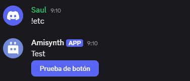

# $addButton[]

Añade un botón a un mensaje.

**Sintaxis**

```
$addButton[¿Nueva fila?;ID/URL de interacción;Etiqueta;Estilo;(¿Deshabilitar?;Emoji;ID del mensaje)]
```

**Parámetros**

- `¿Nueva fila?` (Tipo: Bool || Marca: Obligatorio): Si se establece en sí, el botón aparecerá en una nueva fila. Si se establece en no, el botón aparecerá en la misma fila que el botón anterior.

Un mensaje puede tener un máximo de 25 botones (5 filas de 5 botones).

- `ID/URL de interacción` (Tipo: Cadena, URL || Marca: Obligatorio): Según el tipo de botón, se establece en ID de interacción, que se utiliza en la devolución de llamada $onInteraction[ID], o en URL si se trata de un botón de enlace.

- `Etiqueta` (Tipo: Cadena || Marca: Vaciable): El valor de texto visible en el botón.

- `Estilo` (Tipo: Enumeración || Indicador: Obligatorio): Se utiliza para especificar el color de fondo del botón. Si el botón tiene un enlace/URL, debe establecer el valor en enlace. Consulte esta sección para obtener más detalles.

- `¿Deshabilitar?` (Tipo: Bool || Indicador: Vacante): Si se establece en sí, el botón no se puede presionar. El valor predeterminado es no.

- `Emoji` (Tipo: Emoji || Indicador: Vacante): Agrega un emoji dentro del botón. Los emojis deben pegarse como Unicode, alias o tener el siguiente formato: <:emoji name:emoji ID>.

- `ID de mensaje` (Tipo: Copo de nieve || Indicador: Vacante): Agrega el botón al ID de mensaje proporcionado. Es importante tener en cuenta que el autor del ID de mensaje proporcionado debe ser el bot.


**Ejemplo**

```
Test
$addButton[false;id;Prueba de boton;primary;false]
```

