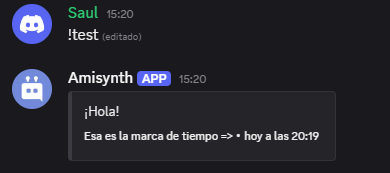

# $addTimestamp[]
Añade una marca de tiempo a una incrustación.

**Sintaxis**
```
$addTimestamp[(Indice)]
```

**Parámetros**

- `Índice` `(Tipo: Entero || Marca: Opcional)`: A qué incrustación se añadirá el texto del autor. (Más información)

**Ejemplo**
```
$description[¡Hola!]
$footer[Esa es la marca de tiempo =>]
$addTimestamp[]
```

