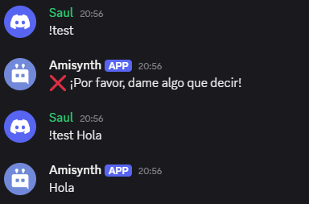

# $argsCheck[]

Al usar esta función, el comando solo se puede ejecutar si el mensaje del usuario contiene una cierta cantidad de argumentos (palabras).

## Sintaxis
```
$argsCheck[¿Cuántos?;Mensaje de error]
```

**Parámetros**

- `¿Cuántos?` `(Tipo: HowMany || Indicador: Obligatorio)`: Cuántos argumentos debe tener el mensaje del usuario.
> Si desea que los usuarios tengan **3 o más argumentos** en su mensaje, puede usar `>3`. Si desea que los usuarios tengan **menos de 3 argumentos** en su mensaje, puede usar `<3`. Si desea que los usuarios tengan **exactamente 3 argumentos** en su mensaje, escriba `3`.

- `Mensaje de error` `(Tipo: String || Indicador: Vaciable)`: El mensaje que el bot enviará si el usuario tiene demasiados o pocos argumentos.

**Ejemplo**
```
$nomention
$argsCheck[>1;❌ ¡Por favor, dame algo que decir!]
$message[-1]
```

