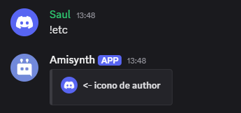

# $authorIcon[]


$authorICon Añade el texto del autor a una incrustación.

**Sintaxis**

```
$authorIcon[URL;(Índice)]
```

**Parámetros**

- `URL` `(Tipo: Cadena || Marca: Vaciable)`: La imagen del icono del autor. Debe ser una URL de imagen válida.

- `Índice` `(Tipo: Entero || Marca: Opcional)`: A qué incrustación se añadirá el texto del autor. (Más información)


**Codigo de ejemplo**

```
$authorIcon[$userAvatar[]]
$author[<- icono de author]
```

