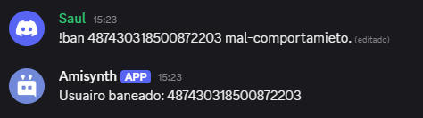

# $ban[] 

Banea a un usuario del servidor mediante su ID y registra una razón.

**Sintaxis**
```
$ban[ID de usuario; Razón del baneo]
```

**Parámetros**
- `ID de usuario` `(Tipo: Entero || Indicador: Obligatorio)`: El ID del usuario que será baneado del servidor.
- `Razón del baneo` `(Tipo: Texto || Indicador: Opcional)`: El motivo por el cual el usuario fue baneado. Si se omite, se registrará "sin razón específica".

**Ejemplo**
```
$argsCheck[>2;❌ Uso incorrecto. Uso: `!ban (ID del usuario) (razón)`]
Usuario Baneado: $message[1]
$ban[$mensaje[1];$message[2]]
```



> El bot debe tener el permiso `Ban Members`.

> Asegúrate de que el ID sea válido y que el usuario esté en el servidor (según las capacidades de tu sistema).

> La razón se guarda si tu sistema o bot la admite para registros o auditoría.

