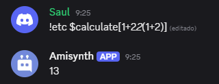

# $calculate[]


**Sintaxis**
```
$calculate[Expresión]
```

**Parámetros**
- `Expresión` `(Tipo: Cadena || Indicador: Obligatorio)`: La expresión matemática a resolver.

**Signos**
- `+` - Suma.
- `-` - Resta.
- `/` - División.
- `*` - Multiplicación.
- `%` - Módulo.
- `**` - Potencia.
- `()` - Paréntesis para insertar ecuaciones.

**Ejemplo**
```
$calculate[$message[-1]] 🧠
```



> [¿Cómo funciona `$enableDecimals[]`?](../funciones/decimals.md)


