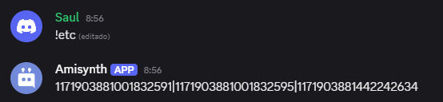

# $categoryIDs[]  

`$categoryIDs[]` retorna todos los nombres de las categorías del servidor.  

### **Sintaxis**  
```
$categoryIDs[separador;(guild opcional)]
```

### **Parámetros**  

- `Separador` `(Tipo: Cadena | Obligatorio)` → Especifica el carácter o texto que separará los nombres de las categorías en la lista. 
 
- `Guild ID` `(Tipo: ID | Opcional)` → ID del servidor del que se desean obtener los nombres de las categorías. Si se omite, se usará el servidor donde se ejecutó el comando.  


### **Ejemplo**  

```python
$categoryIDs[|]
```
🔹 Devuelve algo como: `1171903881001832591|1171903881001832595|1171903881442242634` 

