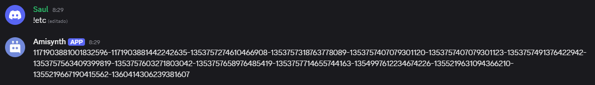

# $channelIDs[]

Enumera todos los nombres de canales separados por un separador.

**Sintaxis**

```
$channelIDs[Separador;(ID del gremio)]
```

**Parámetros**

- `Separador` `(Tipo: Cadena || Marca: Vaciable)`: El separador utilizado para separar los nombres de los canales.

- `ID del gremio` `(Tipo: Copo de nieve || Marca: Opcional)`: El gremio del que se devuelven los nombres de los canales. _(Predeterminado: el gremio actual)_

**Ejemplo**
```
$channelIDs[-;$guildID[]]
```

