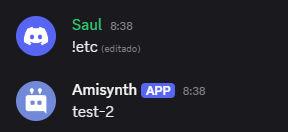

# $channelName[]

Devuelve el nombre del ID del canal proporcionado.
**Sintaxis**
```
$channelName[ID del canal]
```

**Parámetros**
- `ID del canal` `(Tipo: Copo de nieve || Marca: Obligatorio)`: El canal cuyo nombre se devolverá.

> 🧙‍♂️ [¿Cómo encuentro los ID de los canales? (Haz clic aquí)](https://support.discord.com/hc/en-us/articles/206346498-Where-can-I-find-my-User-Server-Message-ID-)

**Ejemplo**
```
$channelName[$channelID[]]
```

