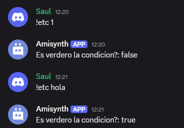
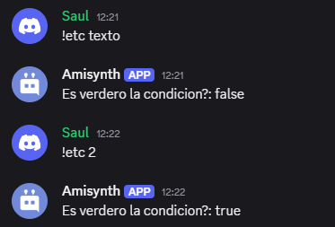

# $checkCondition
Comprueba si una condición es verdadera o falsa.

**Sintaxis**
```
$checkCondition[Condición]
```

**Parámetros**
- `Condición` `(Tipo: Cadena || Marca: Obligatorio)`: La condición a comprobar.

**Operadores**  
- `==` - Igual a

- `!=` - Diferente de

- `<` - Menor que

- `>` - Mayor que

- `>=` - Mayor o igual a

- `<=` - Menor o igual a

**Ejemplos**

**#1**
```
Es verdero la condicion?: $checkCondition[$message[-1]==hola]
```



**#2**
```
Es verdero la condicion?: $checkCondition[$message[-1]==2]
```



