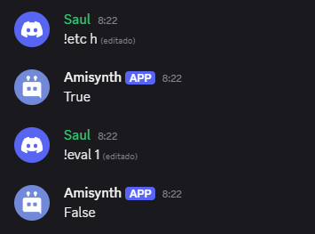

# $checkContains[]

Comprueba si el texto contiene al menos una de las frases proporcionadas.

**Sintaxis**
```
$checkContains[Texto;Frases;...]
```

**Parámetros**

- `Texto` `(Tipo: Cadena || Marca: Vaciable)`: El texto que se comprobará.

- `Frases` `(Tipo: Cadena || Marca: Vaciable)`: Las frases/palabras que el bot comprobará en `Texto`. Separa las frases con `;`.

**Ejemplo**
```
$checkContains[hola;$message[1]]
```
