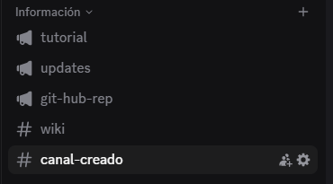
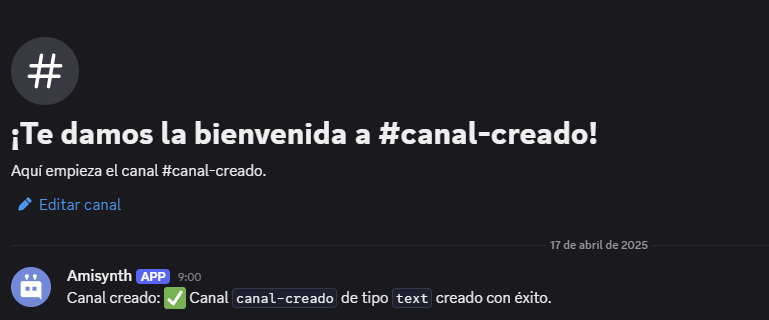

# $createChannel[]

Crea un nuevo canal.

**Sintaxis**
```
$createChannel[Nombre;Tipo;(ID de categoría)]
```
> Discord permite a los usuarios crear hasta 500 canales por servidor. Esto incluye todos los tipos de canales.

**Parámetros**

- `Nombre` `(Tipo: Cadena || Indicador: Obligatorio)`: El nombre del nuevo canal.

> Los nombres de los canales pueden tener un máximo de 100 caracteres.

- `Tipo` `(Tipo: Enumeración || Indicador: Obligatorio)`: El tipo de canal. Tipos de canal:
   - `categoría`
   - `texto`
   - `voz`
   - `escenario`
   - `foro`
   - `ID de categoría` `(Tipo: Copo de nieve || Indicador: Opcional)`: La categoría a la que se asignará el canal (si corresponde).
> [Guía para obtener la ID de categoría.](https://support.discord.com/hc/en-us/articles/206346498-Where-can-I-find-my-User-Server-Message-ID-)

**Ejemplo**
```
$eval[$message[-1]]
```






> [Puede usar `$channelID[]` para obtener el ID del canal.](./authorIDComplex.md)