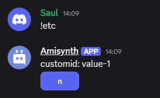

# $customID[]  

`$customID[]` retorna el **ID personalizado** de una interacción con botones o menús desplegables en Discord.  

### **Sintaxis**  
```
$customID[]
```

> 📌 **Nota:** Solo funciona dentro de eventos como `$onInteraction`.  


### **Ejemplo**  

```python
bot = ..

bot.new_event("$onInteraction", "customid: $customID[]")

bot.run(..)
```
🔹 Si un usuario hace clic en un botón con ID `"value-1"`, el bot responderá:  
   **"customid: `value-1`."**  

