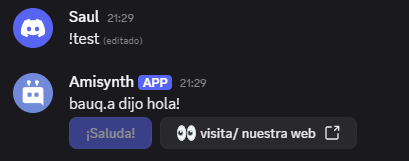

# $editButton
Edita un botón existente.

**Sintaxis**
```
$editButton[ID/URL del botón;Etiqueta;Estilo;(Deshabilitado;Emoji;ID del mensaje)]
```

**Parámetros**

- `ID/URL del botón` `(Tipo: Cadena, URL || Marca: Obligatorio)`: El ID o la URL del botón que se desea editar.

- `Etiqueta` `(Tipo: Cadena || Marca: Vaciable)`: La nueva etiqueta que se muestra en el botón.

- `Estilo` `(Tipo: Enumeración || Marca: Obligatorio)`: El estilo del botón. Todos los estilos se listan [a continuación](#button-style).

- `Deshabilitado` `(Tipo: Bool || Marca: Vaciable)`: Si se establece en `sí`, el botón no se puede presionar. El valor predeterminado es `no`. - `Emoji` `(Tipo: Emoji || Bandera: Vacante)`: Edita o añade un emoji dentro del botón. Los emojis deben pegarse como *Unicode* o tener el siguiente formato `<:emoji name:emoji ID>`.

- `ID de mensaje` `(Tipo: Copo de nieve || Bandera: Vacante)`: Añade un botón al ID de mensaje proporcionado. Es importante tener en cuenta que el autor del ID de mensaje **debe** ser el bot.


**Estilo del botón**
Los botones pueden tener diferentes estilos (colores de fondo).
Aquí se muestran todos los valores posibles para el argumento de la función 

- `primary` - Botón azul
- `secondary` - Botón gris
- `sucess` - Botón verde
- `danger` - Botón rojo
- `link` - Botón de redirección


**Ejemplo**

```
$nomention
$username[] dijo hola!
$editButton[test;¡Saluda!;primary;true;]
$addButton[false;http://botdesignerdiscord.com;Visita nuestra web;link;false;👀]
```


> Para más información, consulta la [Guía de Botones](../gen/Botones.md).