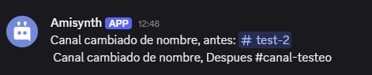

# $editChannelAfter[]

Obtiene el estado **después de la edición** de un canal de servidor de Discord. Esta función es útil cuando quieres acceder a atributos específicos del canal *después* de que haya sido modificado (por ejemplo, cambio de nombre, tema, permisos, etc.).

**Sintaxis**
```
$editChannelAfter[Atributo]
```

**Parámetros**

- `Atributo` `(Tipo: Cadena|| Marca: Obligatorio)`: El nombre del atributo del canal que deseas obtener después de la edición.


> Devuelve el valor del atributo solicitado del canal editado. Si el atributo no existe o no se encuentra disponible, devuelve una cadena vacía (`""`).

**Ejemplo de uso**

```js
Canal cambiado de nombre, antes: #$editChannelBefore[name] $url[decode;%0A]
Canal cambiado de nombre, Despues #$editChannelAfter[name]
```


### 🔎 Atributos comunes disponibles

> Dependiendo del tipo de canal (texto, voz, foro, etc.), los siguientes atributos pueden estar disponibles:

| Atributo           | Descripción                                  |
|--------------------|----------------------------------------------|
| `id`               | ID del canal                                 |
| `name`             | Nombre del canal                             |
| `type`             | Tipo de canal (texto, voz, etc.)             |
| `position`         | Posición en la lista de canales              |
| `topic`            | Tema del canal (solo canales de texto)       |
| `nsfw`             | Si el canal está marcado como NSFW           |
| `bitrate`          | Calidad de audio (solo canales de voz)       |
| `user_limit`       | Límite de usuarios (solo canales de voz)     |
| `slowmode_delay`   | Modo lento en segundos (canales de texto)    |
| `category_id`      | ID de la categoría a la que pertenece        |
| `created_at`       | Fecha de creación del canal                  |
| `permissions_synced` | Si hereda permisos de su categoría         |


> Este comando solo funciona en contextos donde se está procesando un evento de edición de canal (`$onChannelEdit`)


