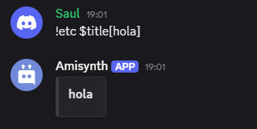
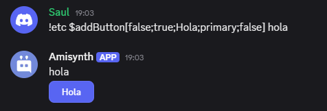

# $eval[]
Evalúa el código proporcionado.

> ⚠️ **¡Se recomienda usar con precaución!** ⚠️

**Sintaxis**
```
$eval[Código fuente]
```

**Parámetros**
- `Código fuente` `(Tipo: Cadena || Marca: Vaciable)`: El código que se evaluará.

**Ejemplo**
```
$eval[$message[-1]]
```



> ¿Cómo funciona [`$message[-1]`](../funciones/message.md)?

> ⚠️ **¡Debe usarse con precaución!** ⚠️
>
> Se recomienda restringir el comando para que solo lo usen los desarrolladores del bot. Esto se puede hacer con:
```
$nomention
$onlyForIDs[$botOwnerID[];❌ ¡No eres mi propietario!]
$eval[$message[-1]]
```




> ¿Cómo funcionan [`$onlyForIDs[]`](../funciones/onlyForIDs.md) y [`$botOwnerID[]`](../funciones/botOwnerID.md)?