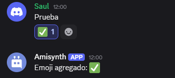

# $eventEmojiAdd[]

Devuelve el **emoji** que fue agregado en un evento de reacción (usado dentro de eventos como `$onReactionAdd` o `$onReactionRemove`).

**Sintaxis**

```plaintext
$eventEmojiAdd[]
```


### 🔄 Retorna:
- El emoji en formato texto o unicode (por ejemplo: `😊`, `🔥`).
- Si es un emoji personalizado, devolverá algo como `<:nombre:id>` o `<a:nombre:id>` si es animado.

**Ejemplo**  

```python
bot = ..

bot.new_event("$onReactionAdd", "Emoji agregado: $eventEmojiAdd[]")

bot.run(..)
```
🔹 Si un usuario llamado "Saul" reacciona con "✅" en el canal `#general`, el bot enviará:  


