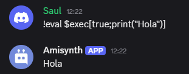

# $exec[]
Ejecuta código Python si se cumple una condición booleana.

**Sintaxis**
```
$exec[condición_booleana;Código python]
```

**Parámetros**

- `condición_booleana` `(Tipo: Bool || Marca: Obligatorio)`: Expresión booleana que debe evaluarse como `True` para ejecutar el código.

- `código_python` `(Tipo: Código || Marca: Obligatorio)`: Código Python que se ejecutará si la condición es verdadera. Puede incluir llamadas como `print()`, operaciones, etc.


```
$eval[$message[-1]]
```

