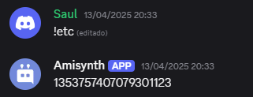

# $findChannel[]

Busca el ID de un canal a partir del nombre, ID o mención del canal.

> Esta función solo puede encontrar canales del servidor **actual**.

**Sintaxis**
```
$findChannel[Channel]
```

**Parámetros**
- `Channel` `(Tipo: Cadena || Marca: Vaciable)`: El nombre, ID o mención del canal que se buscará.

**Ejemplo**
```
$findChannel[$channelID[]]
```



> [¿Cómo funciona `$mentionedChannels[]`?](../funciones/mentionedChannels.md)