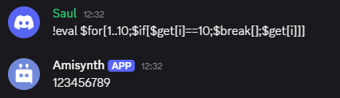
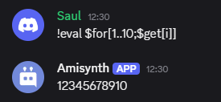

# $for[]

Ejecuta un bloque repetidamente dentro de un rango definido.

**Sintaxis**
```
$foor[inicio..fin; código]
```

**Parámetros**

- `Inicio..fin` `(Tipo: Rango || Marca: Obligatorio)`: Define el rango numérico (inclusive) en el que se ejecutará el código repetidamente.  
  Ejemplo: `1..5` ejecuta el bloque 5 veces, con valores del 1 al 5.

- `Código` `(Tipo: Código || Marca: Obligatorio)`: Código que se ejecutará en cada iteración. Puede incluir `$get[iterador]` para acceder al número actual del ciclo.

¿Quieres que esta estructura soporte anidación de ciclos `$foor` dentro de otros? También puedo ayudarte a implementar la lógica Python detrás si estás armando el evaluador.


**Ejemplo**

```
$eval[$message[-1]]
```



