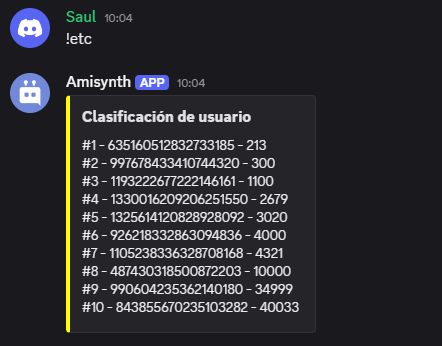

# $getLeaderboardValue
Obtiene un valor de la tabla de clasificación.

**Sintaxis**
```
$getLeaderboardValue[Tipo de variable;Nombre de la variable;Tipo de ordenación;Posición;(Tipo de retorno)]
```

**Parámetros**
- `Tipo de variable` `(Tipo: Enum || Indicador: Obligatorio)`: El tipo de la variable. Tipos de variable:

    - `users` - [Variable de usuario](../gen/variables.md#user-variables)
    - `guilds` - [Variable de servidor](../gen/variables.md#server-variables)
    - `channels` - [Variable de canal por servidor](../gen/variables.md#server-variables)
    - `global` - [Variable global](../gen//variables.md#globalglobal-user-variables)
    - `global_users` - [Variable de usuario global](../gen//variables.md#globalglobal-user-variables)

- `Variable name` `(Type: String || Flag: Required)`: El nombre de la variable para la que se generará la tabla de clasificación.

- `Sort type` `(Type: Enum || Flag: Required)`: El tipo de ordenación. Tipos de ordenación:
   - `asc` - Ordena los valores en orden ascendente.
   - `desc` - Ordena los valores en orden descendente. 
   
- `Posición` `(Tipo: Cuántos || Indicador: Obligatorio)`: La posición en la tabla de clasificación que se obtendrá, p. ej., `1`, `3`, etc.

- `Tipo de retorno` `(Tipo: Enumeración || Indicador: Opcional)`: El tipo de retorno. Tipos de retorno:

    - `id` - Devuelve el ID del usuario que pertenece a esta posición.
    - `value` - Devuelve el valor de la variable de esta posición.
    - `ninguno` - Si se excluye este campo, se devolverá `Nombre de usuario - Valor`.

**Ejemplo**
```
$title[**Clasificación de usuario**]
$description[#1 - $getLeaderboardValue[users;dinero;asc;1]
#2 - $getLeaderboardValue[users;dinero;asc;2]
#3 - $getLeaderboardValue[users;dinero;asc;3]
#4 - $getLeaderboardValue[users;dinero;asc;4]
#5 - $getLeaderboardValue[users;dinero;asc;5]
#6 - $getLeaderboardValue[users;dinero;asc;6]
#7 - $getLeaderboardValue[users;dinero;asc;7]
#8 - $getLeaderboardValue[users;dinero;asc;8]
#9 - $getLeaderboardValue[users;dinero;asc;9]
#10 - $getLeaderboardValue[users;dinero;asc;10]]
$color[FFFF00]

```



> Para más información, consulta la [Guía de Variables](../gen/variables.md).