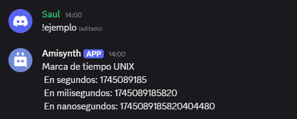

# $getTimestamp[]


Devuelve la [marca de tiempo UNIX](https://www.unixtimestamp.com/) actual en la unidad de tiempo seleccionada.

**Sintaxis**
```
$getTimestamp[(Unidad de tiempo)]**
```

**Parámetros**
- `Unidad de tiempo` `(Tipo: Enumeración || Indicador: Opcional)`: Establece la unidad de tiempo de la marca de tiempo.

> 📝 El valor de la unidad de tiempo puede ser:
> - `s` (segundos)
> - `ms` (milisegundos)
> - `ns` (nanosegundos)

**Ejemplo**
```
Marca de tiempo UNIX
En segundos: $getTimestamp[s]
En milisegundos: $getTimestamp[ms]
En nanosegundos: $getTimestamp[ns]
```



> 📄 Para obtener más información sobre las marcas de tiempo UNIX en Discord, haz clic [aquí](../resources/discordTimestamps.md).