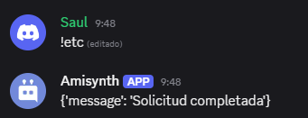

# $httpDelete[]

Envía una solicitud HTTP de tipo **DELETE** a la URL indicada, incluyendo un cuerpo en formato JSON si es necesario.

> Aunque el método DELETE normalmente no lleva cuerpo, algunas APIs modernas aceptan un JSON adicional para confirmar la acción, proporcionar autenticación extra o especificar detalles sobre lo que se eliminará.

## Sintaxis
```
$httpDelete[url;json]
```

### Parámetros

- `url` `(Tipo: Cadena || Requerido)`: Dirección completa del recurso que se desea eliminar (por ejemplo: `https://api.ejemplo.com/usuarios/123`).
- `json` `(Tipo: Cadena || Requerido)`: Datos adicionales en formato JSON que se incluirán en el cuerpo de la solicitud DELETE.

### Uso común

- Eliminar un recurso específico (usuario, archivo, sesión, etc.).
- Confirmar la eliminación con datos adicionales si la API lo requiere.

### Ejemplo

```bash
$httpAddHeader[Authorization;Bearer abc123]
$httpDelete[https://api.ejemplo.com/usuarios/123;{"confirmar":True}]
$httpResult[-1]
```

### Resultado esperado



📷 *Tal como se muestra en la imagen del bot Amisynth respondiendo: `{'message': 'Solicitud completada'}`.*
