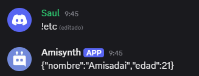

# $httpPost[]

Envía una solicitud HTTP de tipo **POST** a la URL especificada, enviando datos en formato JSON en el cuerpo de la solicitud.

> Este tipo de solicitud se utiliza comúnmente para enviar datos a un servidor, como cuando se crea un nuevo recurso, se envían formularios o se realiza una autenticación. La función permite interactuar con APIs externas de forma sencilla desde tu entorno.

## Sintaxis
```
$httpPost[Url;Json]
```

### Parámetros

- `Url` `(Tipo: Cadena || Requerido)`: La dirección completa a la que se enviará la solicitud POST (por ejemplo, `https://api.ejemplo.com/usuarios`).
- `Json` `(Tipo: Cadena || Requerido)`: El cuerpo del mensaje en formato JSON que se enviará con la solicitud.

### Comportamiento

- El contenido enviado debe tener una estructura válida en formato JSON.
- Por defecto, algunos encabezados como `Content-Type: application/json` pueden estar predefinidos, pero se pueden sobrescribir usando `$httpAddHeader`.

### Uso común

- Enviar datos a una API REST.
- Crear registros en una base de datos remota.
- Enviar formularios complejos con múltiples campos.

### Ejemplo
```bash
$httpAddHeader[Authorization;Bearer abc123]
$httpPost[https://api.ejemplo.com/usuarios;{'nombre':'Amisadai','edad':21}]
$httpResult[-1]
```

### Resultado

- Devuelve la respuesta del servidor (puede ser un JSON, un mensaje, un código, etc.).
- Si hay un error en la solicitud (como una URL incorrecta o JSON malformado), se puede recibir un mensaje de error o código de estado.



