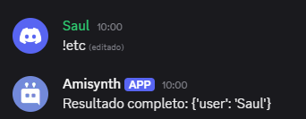

# $httpResult[]

Extrae un valor de la **respuesta JSON** obtenida por cualquier solicitud HTTP (`GET`, `POST`, `PUT`, `PATCH`, `DELETE`).

## Sintaxis
```
$httpResult[Clave]
```

### Parámetros

- `clave` `(Tipo: Cadena || Requerido)`: Nombre de la propiedad JSON que deseas obtener del resultado. Por ejemplo, si el JSON contiene `{ "nombre": "Saul" }`, puedes usar `$httpResult[nombre]` para obtener `"Saul"` y si se proporciona `-1` devuelve todo el JSON.

### Ejemplo

```txt
$httpGet[https://api.ejemplo.com/search/usuarios/487430318500872203]
Usuario encontrado: $httpResult[user]
```


O para obtener todo:

```txt
$httpGet[https://api.ejemplo.com/search/usuarios/487430318500872203]
Resultado completo: $httpResult[-1]
```



