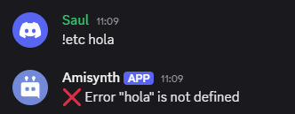

# $if[]


Ejecuta el siguiente bloque de código si la condición proporcionada es verdadera.

**Sintaxis**  

```
$if[Condición;Bloque verdadero;Bloque Falso]
```

**Parámetros**  
- `Condición` `(Tipo: Cadena || Bandera: Obligatoria)`: Verificación que se llevará a cabo.

- `Bloque falso` `(Tipo: Cadena || Bandera: Obligatoria)`: Bloque verdadero a devolver.

- `Bloque verdadero` `(Tipo: Cadena || Bandera: Obligatoria)`: Bloque false a devolver.

**Operadores**  
- `==` - Igual a

- `!=` - Diferente de

- `<` - Menor que

- `>` - Mayor que

- `>=` - Mayor o igual a

- `<=` - Menor o igual a

> Estos operadores pueden variar en su significado dependiendo del orden o la intención de la declaración `if`.

> Si usas texto como `x` y/o `y`, no podrás usar otros operadores que no sean `==` y `!=`. Sin embargo, si trabajas con números, puedes usar cualquiera de los operadores mencionados en la lista anterior.

**Ejemplo**
```
// Buen Uso
$if[$checkCondition[h==$message[-1]];Verdadero;Falso]  
```


```
// Mal Uso
$if[hola==$message[-1];Verdadero;Falso]  
```

