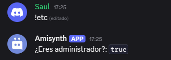

# $isAdmin[]

Devuelve si el usuario proporcionado tiene permisos de administrador.

> "true" significa que el usuario tiene permisos de administrador, "false" significa que no los tiene.

## Sintaxis
```
$isAdmin[ID de usuario]
```

### Parámetros
- `ID de usuario` `(Tipo: Copo de nieve || Marca: Obligatorio)`: El usuario a verificar.

### Ejemplo
```
$nomention
¿Eres administrador?: `$isAdmin[$authorID[]]`
```
