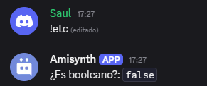

# $isBoolean[]

Devuelve si el texto proporcionado es un booleano o no.

> "true" significa que el texto es un booleano, "false" significa que no lo es.

## Sintaxis
```
$isBoolean[Texto]
```

### Parámetros
- `Texto` `(Tipo: Cadena || Marca: Vaciable)`: El texto a comprobar.

### Valores booleanos admitidos
Positivo | Negativo
-------- | --------
true | false
yes | no
on | off
enable | Deshabilitar

### Ejemplo
```
¿Es booleano?: `$isBoolean[keso]`
```


