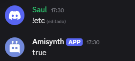

# $isHoisted[]


Devuelve si un rol se muestra por separado o no.

> 🧙‍♂️ "true" significa que el rol está activado, "false" significa que no.

## Sintaxis
```
$isHoisted[ID del rol]
```

### Parámetros
- `ID del rol` `(Tipo: Copo de nieve || Indicador: Obligatorio)`: El rol para comprobar su estado activado.

### Ejemplo
```
$nomention
$isHoisted[$findRole[1171903881001832590]]
```


