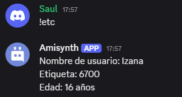

# $json[]
La función $json recupera valores JSON de una clave especificada en el objeto JSON actual.

> La función $json devolverá una cadena vacía si el valor es nulo, la clave no existe, no se ejecutaron las funciones $jsonParse o $jsonSet, o se ejecutó $jsonClear.

Sintaxis
```
$json[Key;...]
```
Parámetros

- `Key` `(Tipo: String || Flag: Required)`: La clave JSON que se recuperará.

Ejemplos
```
# Sin arrays

$jsonParse[{
    'username': 'Izana',
    'tag': '6700',
    'identity': {
        'age': 16
        }
    }]

Nombre de usuario: $json[username]
Etiqueta: $json[tag]
Edad: $json[identity;age] años
```




> Para obtener más información, consulte la Guía de [JSON Funciones](../gen/json.md).