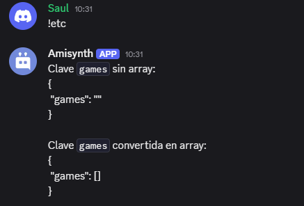

# $jsonArray []
La función `$jsonArray` marca una clave JSON especificada como un **array**.  

## Sintaxis 
```plaintext
$jsonArray[Key;...]
```

### Parámetros
- `Key` `(Tipo: String || Obligatorio)`: La clave JSON que será marcada como un array.  

### Ejemplo
```plaintext

$jsonParse[{
    'games': ''
}]

Clave `games` sin array:  
$jsonPretty[4]  

$jsonArray[games]  

Clave `games` convertida en array:  
$optOff[$jsonPretty[4]]  
```




> Para obtener más información, consulte la Guía de [JSON Funciones](../gen/json.md).