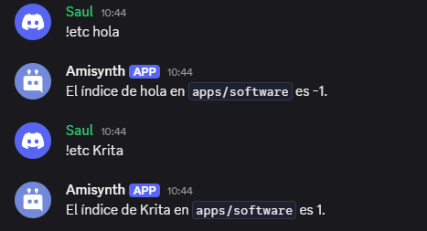

# $jsonArrayIndex[]

La función `$jsonArrayIndex` obtiene el índice de un valor dentro de un array JSON.  

> La función `$jsonArrayIndex` devolverá `-1` si el valor no se encuentra y devolverá un resultado vacío si no se ejecutaron `$jsonParse` o `$jsonSet`, o si se ejecutó `$jsonClear`.  

**Sintaxis**  
```plaintext
$jsonArrayIndex[Key;...;Value]
```

**Parámetros**  
- `key` `(Tipo: String || Obligatorio)` La clave JSON donde se buscará el valor.  
- `value` `(Tipo: String, Integer, Float || Obligatorio)` El valor a buscar dentro del array.  

**Ejemplo**  
```plaintext
$jsonParse[{
    'computer': [{
        'apps': {
            'software': ['BlueStacks', 'Krita', 'Visual Studio Code'],
            "games": ['GTA 5', 'RDR 2', 'CS:GO', 'Cyberpunk 2077']
        }
    },{
        'cpu': 'Intel',
        'gpu': 'NVIDIA',
        'ram': 'XPG'
    }]
}]


El índice de `$message[-1]` en `apps/software` es: $jsonArrayIndex[computer;0;apps;software;$message[-1]].
```  




> Para obtener más información, consulte la Guía de [JSON Funciones](/General/json-funciones.md).