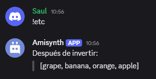

# $jsonArrayReverse[]
La función `$jsonArrayReverse` invierte el orden de un array JSON específico.  

**Sintaxis**  
```plaintext
$jsonArrayReverse[Key;...]
```

**Parámetros**  
- `key` `(Tipo: String || Opcional)` La clave del array JSON que se invertirá.  

**Ejemplo**  
```plaintext

$jsonParse[{
  'fruits': ['apple', 'orange', 'banana', 'grape']
}]

$jsonArrayReverse[fruits]

Después de invertir:
> $json[fruits]
```  




> Para obtener más información, consulte la Guía de [JSON Funciones](../gen/json.md).
