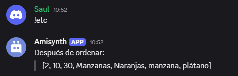

# $jsonArraySort[]

La función `$jsonArraySort` ordena un array JSON específico en orden ascendente.  

> La función ordena los elementos en el siguiente orden:  
> 1. Números enteros de menor a mayor.  
> 2. Cadenas de texto basadas en sus valores ASCII/Unicode.  

**Sintaxis**  
```plaintext
$jsonArraySort[Key;...]
```

**Parámetros**  
- `key` `(Tipo: String || Opcional)` La clave del array JSON que se ordenará.  

**Ejemplo**  
```plaintext
$jsonParse[{
  'data': ['Oranges', 'banana', 10, 'apple', 'Apples', 2, 30]
}]

$jsonArraySort[data]

Después de ordenar:
> $json[data]
```  




> Para obtener más información, consulte la Guía de [JSON Funciones](/gen/json.md).