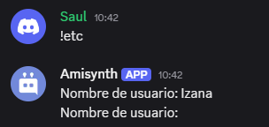

# $jsonClear[]
La función `$jsonClear` elimina el objeto JSON actual, restableciendo su contenido.  

**Sintaxis**  
```plaintext
$jsonClear[]
```

**Ejemplo**  
```plaintext
$jsonParse[{
    'username': 'Izana',
    'tag': '6700',
    'identity': {
        'age': 16
        }
    }]
Nombre de usuario: $json[username]  
$jsonClear[]
Nombre de usuario: $json[username]
```  




> Para obtener más información, consulte la Guía de [JSON Funciones](../gen/json.md).