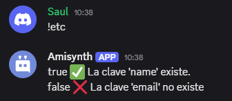

# $jsonExists[]
La función `$jsonExists` verifica si una clave JSON especificada existe en el objeto JSON actual.  

> Devuelve un resultado vacío si no se ejecutaron las funciones `$jsonParse` o `$jsonSet`, o si se ejecutó `$jsonClear`.  

**Sintaxis**  
```plaintext
$jsonExists[Key;...]
```

**Parámetros**  
- `Key` `(Tipo: String || Flag: Required)`: La clave JSON que se verificará.  

**Ejemplo**  

```
$jsonParse[{
    'user': {
        'name': 'Amisadai',
        'age': 20
    }
}]

$jsonExists[user;name] ✅ La clave 'name' existe.
$jsonExists[user;email] ❌ La clave 'email' no existe.
```  




> Para obtener más información, consulte la Guía de [JSON Funciones](../gen/json.md).