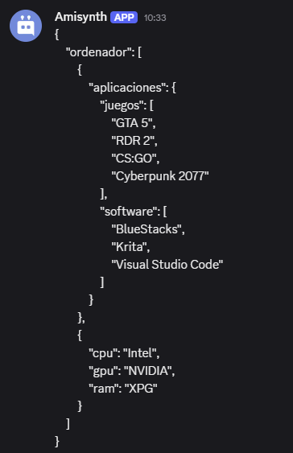

# $jsonPretty[]
La función `$jsonPretty` convierte el objeto JSON actual en una cadena formateada con sangría para una mejor visualización.  

> La función `$jsonPretty` devolverá un resultado vacío si no se ejecutaron las funciones `$jsonParse` o `$jsonSet`, o si se ejecutó `$jsonClear`.  

**Sintaxis**
```plaintext
$jsonPretty[Indent length]
```

**Parámetros**
- `Indent length` `(Tipo: Integer || Flag: Required)`: La cantidad de espacios usados para la indentación. Generalmente es `2` o `4`.  

**Ejemplo** 
```plaintext
$nomention
$disableInnerSpaceRemoval
$jsonParse[{
    'ordenador': [{
        'aplicaciones': {
            'software': ['BlueStacks', 'Krita', 'Visual Studio Code'],
            'games': ['GTA 5', 'RDR 2', 'CS:GO', 'Cyberpunk 2077']
        }
    },{
        'cpu': 'Intel',
        'gpu': 'NVIDIA',
        'ram': 'XPG'
    }]
}]

$jsonPretty[4]
```
