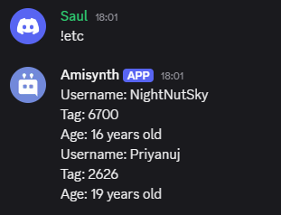

# $jsonSet[]  
La función `$jsonSet` establece o reemplaza el valor en la clave JSON especificada.  

### **Sintaxis**  
```plaintext
$jsonSet[Key;...;Value]
```

### **Parámetros**  
- `Key` `(Tipo: String || Obligatorio)`: La clave JSON donde se establecerá o reemplazará el valor.  
- `Value` `(Tipo: Integer, Bool, Float, String || Obligatorio)`: El valor que se asignará o reemplazará en la clave especificada.  

### **Ejemplo**  
```plaintext
$jsonParse[{
    'username': 'Izana',
    'tag': "6700",
    'identity': {
        'age': 16
    }
}]

Nombre de usuario: $json[username]  
Etiqueta: $json[tag]  
Edad: $json[identity;age] años  

$jsonSet[username;Priyanuj]  
$jsonSet[tag;2626]  
$jsonSet[identity;age;19]  


Nombre de usuario: $json[username]  
Etiqueta: $json[tag]  
Edad: $json[identity;age] años
```  




> Para obtener más información, consulte la Guía de [JSON Funciones](/General/json-funciones.md).