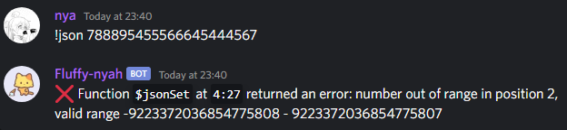
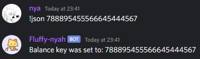

# $jsonSetString[]
La función `$jsonSetString` establece o reemplaza el valor en la clave JSON especificada. Siempre establece el valor como una cadena.  

**Sintaxis** 
```plaintext
$jsonSetString[Key;...;Value]
```

**Parámetros**
- `Key` `(Tipo: String || Flag: Required)`: La clave JSON donde se establecerá o reemplazará el valor.  

- `Value` `(Tipo: String || Flag: Required)`: El valor a establecer o reemplazar.  

> Esta función se recomienda principalmente para comandos relacionados con economía.  

**Ejemplo**
```plaintext
$nomention
$jsonParse[{}]

$jsonSet[balance;$message]

Balance key was set to: $json[balance]
```



Usando `$jsonSetString`  
```plaintext
$nomention
$jsonParse[{}]

$jsonSetString[balance;$message]

Balance key was set to: $json[balance]
```


> Para obtener más información, consulte la Guía de [JSON Funciones](../gen/json.md).