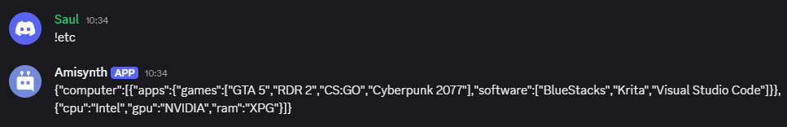

# $jsonStringify[]
La función `$jsonStringify[]` convierte el objeto JSON actual en una cadena de texto.  

> La función `$jsonStringify[]` devolverá una cadena vacía si no se ejecutaron las funciones `$jsonParse` o `$jsonSet`, o si se ejecutó `$jsonClear`.  

### **Sintaxis**  
```plaintext
$jsonStringify[]
```

### **Ejemplo**  
```plaintext

$jsonParse[{
    'computer': [{
        'apps': {
            'software': ['BlueStacks', 'Krita', 'Visual Studio Code'],
            'games': ['GTA 5', 'RDR 2', 'CS:GO', 'Cyberpunk 2077']
        }
    },{
        'cpu': 'Intel',
        'gpu': 'NVIDIA',
        'ram': 'XPG'
    }]
}]

$jsonStringify[]
```

