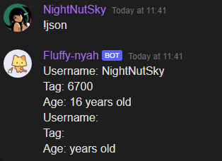

# $jsonUnset[]  
La función `$jsonUnset` elimina el valor en la clave JSON especificada.  
En resumen, es la función opuesta a `$jsonSet`.  

### `Sintaxis`  
```plaintext
$jsonUnset[Key;...]
```

### `Parámetros`  
- `Key` `(Tipo: String || Flag: Required)`: La clave JSON que se eliminará.  

### `Ejemplo`  
```plaintext
$jsonParse[{
    "username": "NightNutSky",
    "tag": "6700",
    "identity": {
        "age": 16
    }
}]

Username: $json[username]
Tag: $json[tag]
Age: $json[identity;age] years old

$jsonUnset[username]
$jsonUnset[tag]
$jsonUnset[identity;age]

$optOff[Username: $json[username]
Tag: $json[tag]
Age: $json[identity;age] years old]
```




> Para obtener más información, consulte la Guía de [JSON Funciones](/General/json-funciones.md).