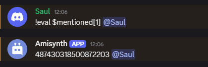

# $mentioned[]

Devuelve el ID del usuario mencionado.

**Sintaxis**

```
$mentioned[Número de mención]
```

**Parámetros**

- `Número de mención` `(Tipo: HowMany || Indicador: Obligatorio)`: La mención del usuario que se obtiene del mensaje del autor (`1` = primera mención, `2` = segunda, etc.).

- `¿Devolver autor?` `(Tipo: Bool || Bandera: Opcional)`: Si se debe devolver el ID del autor si no se menciona ningún usuario o no.

**Ejemplo**
```
$eval[$message[-1]]
```

