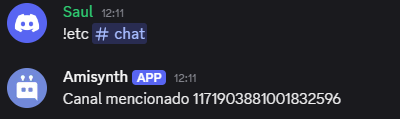

# $mentionedChannels[]

Devuelve el ID del canal mencionado.

**Sintaxis**
```
$mentionedChannels[Número de mención;(¿Devolver actual?)]
```

**Parámetros**

- `Número de mención` `(Tipo: HowMany || Indicador: Obligatorio)`: La mención del canal que se obtiene del mensaje del autor (`1` = primera mención del canal, `2` = segunda, etc.).

- `¿Devolver actual?` `(Tipo: Bool || Indicador: Opcional)`: Si se devuelve el ID del canal actual si no se menciona ningún canal.

**Ejemplo**
```
Canal mencionado $mentionedChannels[1]
```


